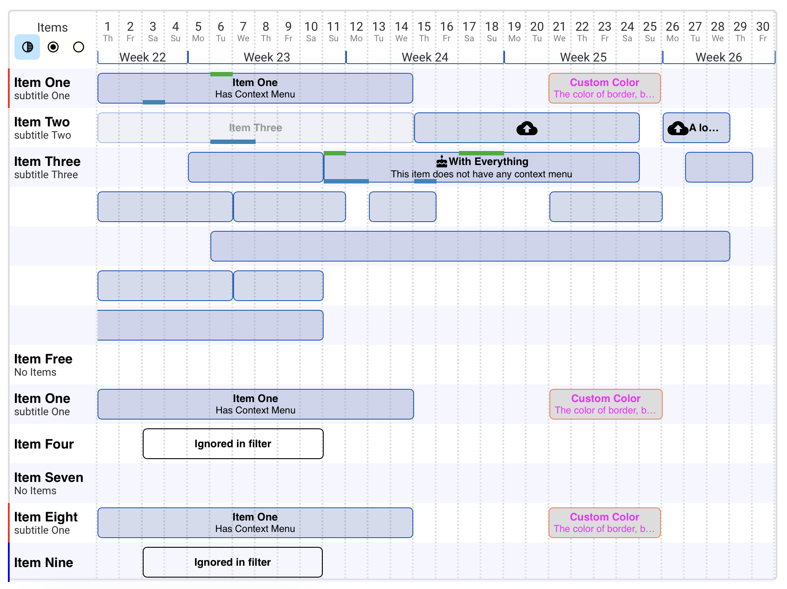

# Vieolo UI
The UI package for front-end applications using React.


*VUI is still in early stages and we expect to have many breaking changes before reaching to v1.0.0*



<br>

## Goals
1. Providing a complete set of UI components that are required to create a full-blown front-end application with all the batteries included, with stable, responsive, accessible, and optimized components.
2. Easy setup in a target project while allowing the implementer to modify every aspect of the design of every component using SCSS
3. Removing the need to create a custom CSS class for a new component/layout. Most of custom components/layouts should be achievable with a combination of differenet VUI components without leaving the `.tsx` file.

<br>

## Setup

Follow these steps:

1. Install the package

```bash
npm install @vieolo/vieolo-ui
```

2. Create two `.scss` files named:
- `_project.scss`
- `style.scss`

The name of the files are arbitrary but the first file should have a `_` at the begining.

3. Import the SCSS files of VUI into `_project.scss` from node modules folder. You can override the SCSS variables and classes in this file to customise your UI as you wish.

```SCSS

// Override the base variables such as base-unit above the import line

// Only the _vieolo-ui.scss should be imported
@import '../../node_modules/@vieolo/vieolo-ui/style/_vieolo-ui.scss';

// Override the classes below the import line
```

4. Import `_project.scss` at the top of `style.scss`

```SCSS
@import "project";

// The rest of style of your project
```

5. Import the style file into your react entry file.

``` JS
import './style/index.scss'
```

You're good to go. You can now modify the components of Vieolo UI as you wish to a create customised feel and experience.

<br>

<br>

## Usage
(Recommended)

Components can be imported individually. This type of import will produce the smallest build size after the tree shaking
```js
import Button from '@vieolo/vieolo-ui/Button';
import IconButton from '@vieolo/vieolo-ui/IconButton';
```

(Not Recommended)
Components can also be imported in the following manner. This way, however, may result in an extremely large build size as the tree shaking may fail.
```JS
import { IconButton, Button } from '@vieolo/vieolo-ui'
```

<br>

## Development View
In order to develop the components, run
```
npm start
```
which starts the development server. The components are displayed in the `App.tsx` and can be developed with the hot reload functionality.

<br>

## Components

- [`BarChart`](docs/BarChart/BarChart.md)
- [`Flex`](docs/Flex/Flex.md)
- [`Modal`](docs/Modal/Modal.md)


<br>

## Design Principles

VUI has three SCSS files.

- `_base.scss`: contains the variables
- `_general.scss`: contains generic and common classes
- `_vieolo-ui.scss`: contains the classes of components

All the components use the variables and classes that have been defined in `_base.scss` and `_general.scss`. Changing these base values will define the style language of your UI.


### Base Unit
Base unit (default: `10px`) is the base value used to create a uniform and consistent design and experience. All of the designs should use the base unit to measure and size different components.<br/>
- `base-unit`: defaults to `10px`
- `base-unit-half`: base-unit divided by two
- `base-unit-two`: base-unit multiplied by two


### Margins and Paddings
The margins between the columns, cards, and components should be kept at one base unit as much as practically possible. The margin between buttons, however, should be kept at half a unit.<br>
The padding of the rows and cards, should be kept at either one base unit or half a unit.

### Row Height
Row height is the standardization of horizontally long components (such as table rows, bars, buttons, etc.) to create a consistent design with minimum effort. There are four different heights:
- `small`: equal to 3 base units
- `medium`: equal to 4 base units
- `large`: equal to 5 base units
- `over`: equal to 7 base units

<br />
The child components of these components should ideally be one unit smaller. For example, if a row has a `medium` height, the button inside should have a `small` height.

### Border Radius
There are three border radius measurements defined.
- `half`: equal to half a unit
- `normal`: equal to 1 base unit
- `full`: equal to 2 base units

### Color Pallet
There are 3 main colors, 4 utility colors, and 3 accessory colors. The names of the colors are:
- `primary` (main) 
- `secondary` (main)
- `tertiary` (main)
- `alert` (Utility)
- `error` (Utility)
- `success` (Utility)
- `neutral` (Utility)
- `accessory-green` (Accessory)
- `accessory-orange` (Accessory)
- `accessory-blue` (Accessory)

<br/>

Primary color is the main color used in your application, followed by secondary color. Tertiary color should be used very minimally. Accessory colors can be useful in some cases, but should not be used regularly.

Success, error, and alert colors should only be used to convey the tone of a statement.

<br/>

Each color should have these variations:
- `normal`: The normal color
- `light`: The lighter version of the normal, should not be a totally different color.
- `transparent`: Similar to light variation, but is transparent.
- `text`: The color of text when the background color is `normal`
- `gradient` A gradient variant